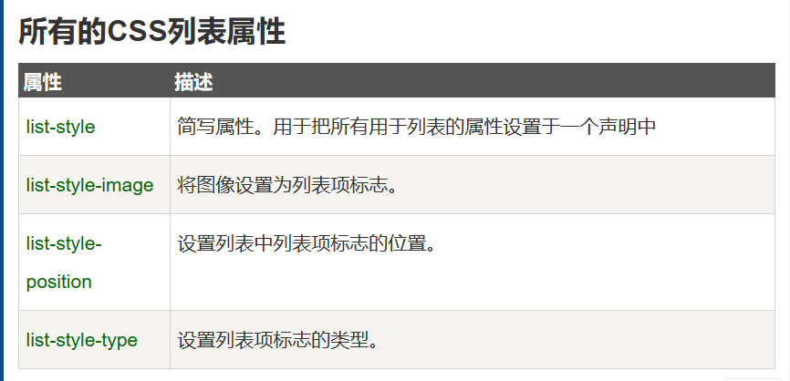
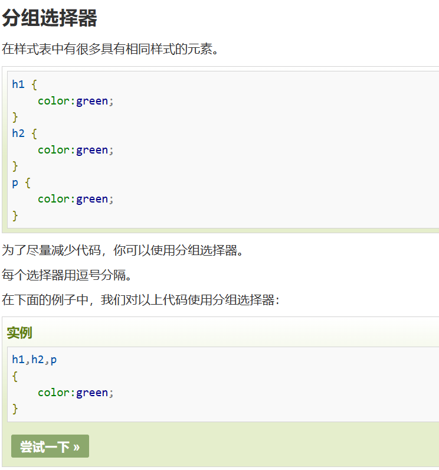
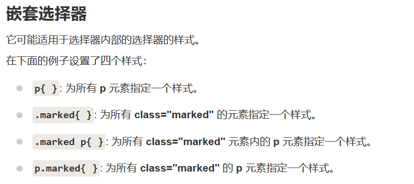

# css学习
---
## 选择器（id与class）
  #名字与.名字
  
## 字体大小
1em和当前字体大小相等。在浏览器中默认的文字大小是16px。
因此，1em的默认大小是16px。可以通过下面这个公式将像素转换为em：px/16=em

## 列表属性

```css

ul.a {list-style-type: circle;}
ul.b {list-style-type: square;}
 
ol.c {list-style-type: upper-roman;}
ol.d {list-style-type: lower-alpha;}

```
### 列表还可以标记为图像

```css
ul{list-style-image: url('sqpurple.gif');}
```

### 浏览器兼容性解决方案

```css
  ul
{
    list-style-type: none;
    padding: 0px;
    margin: 0px;
}
ul li
{
    background-image: url(sqpurple.gif);
    background-repeat: no-repeat;
    background-position: 0px 5px; 
    padding-left: 14px; 
}
```

### 移除默认设置

```css
  ul {
  list-style-type: none;
  margin: 0;
  padding: 0;
}
```
## 所有css列表属性


# 盒子模型
      Margin(外边距) - 清除边框外的区域，外边距是透明的。
      Border(边框) - 围绕在内边距和内容外的边框。
      Padding(内边距) - 清除内容周围的区域，内边距是透明的。
      Content(内容) - 盒子的内容，显示文本和图像。  

# 选择器的分组与嵌套
## 分组

## 嵌套


# position
[学习链接](https://www.runoob.com/css/css-positioning.html)

# flow
[学习链接](https://www.runoob.com/css/css-overflow.html)

# float
[学习链接](https://www.runoob.com/css/css-float.html)

# 选择器
[学习链接](https://www.runoob.com/css/css-combinators.html)

# Pseudo-classes
[学习链接](https://www.runoob.com/css/css-pseudo-classes.html)

# 导航栏与下拉菜单
[学习链接](https://www.runoob.com/css/css-navbar.html)

# CSS提示工具
[学习链接](https://www.runoob.com/css/css-tooltip.html)

# CSS 修饰表单
[学习链接](https://www.runoob.com/css/css-form.html)

# css网站响应式布局
[学习链接](https://www.runoob.com/css/css-website-layout.html)


